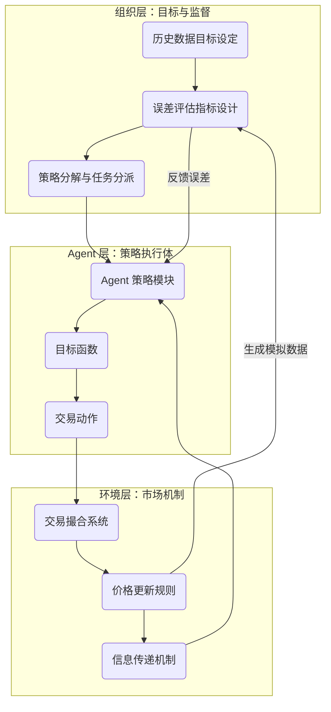

```mermaid
flowchart TD

subgraph ORGANIZATION [组织层：目标与监督]
    O1(历史数据目标设定)
    O2(误差评估指标设计)
    O3(策略分解与任务分派)
end

subgraph AGENT [Agent 层：策略执行体]
    A1(Agent 策略模块)
    A2(目标函数)
    A3(交易动作)
end

subgraph ENVIRONMENT [环境层：市场机制]
    E1(交易撮合系统)
    E2(价格更新规则)
    E3(信息传递机制)
end

O1 --> O2
O2 --> O3
O3 --> A1
A1 --> A2
A2 --> A3
A3 --> E1
E1 --> E2
E2 --> E3
E3 --> A1

%% Feedback loop
E2 -->|生成模拟数据| O2
O2 -->|反馈误差| A1
```
